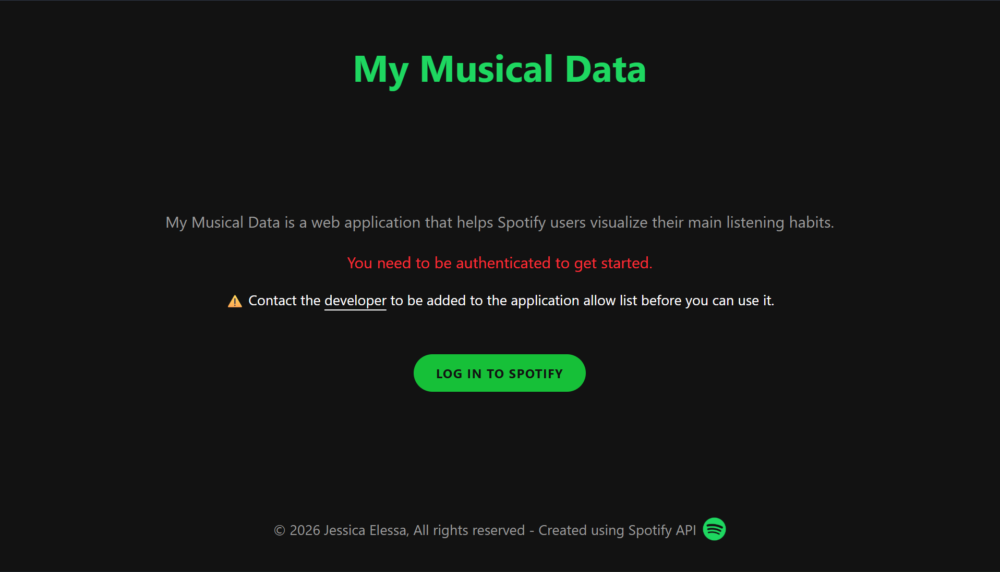
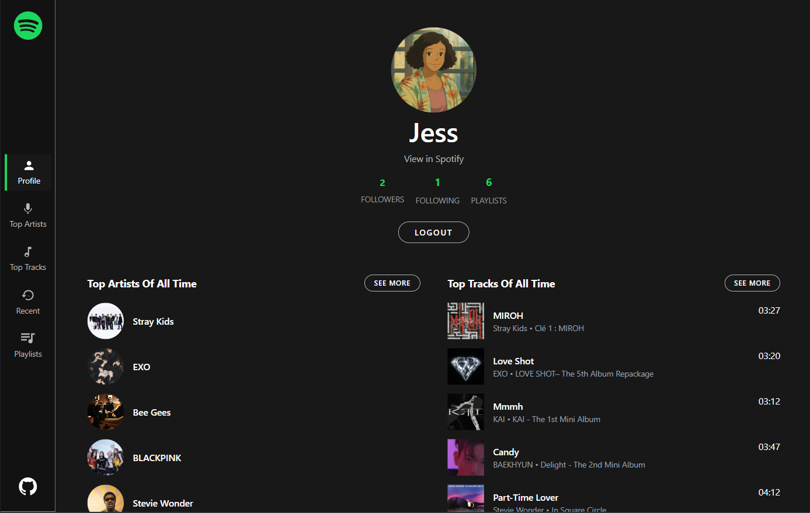
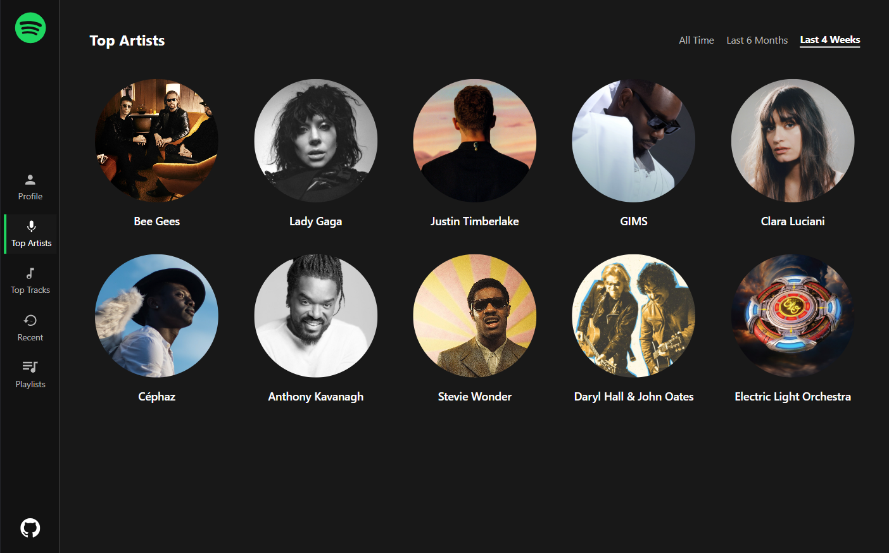
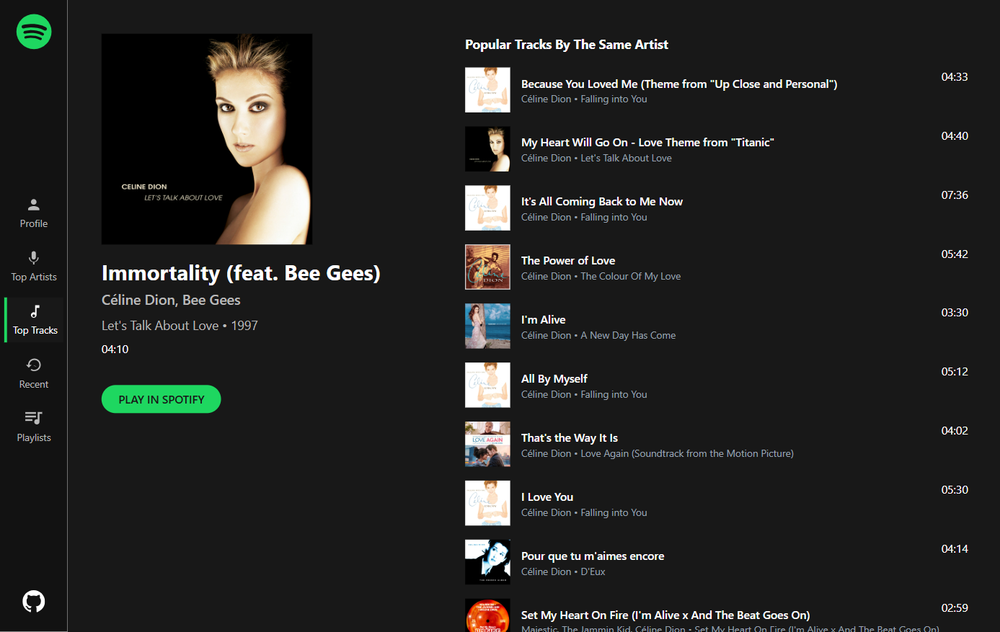

# My Musical Data

My Musical Data is a web application that allows Spotify users to visualize their listening habits and explore their personal library through a clean, data-driven dashboard.

## Table of Contents

- [Demo](#demo)
- [Stack](#stack)
  - [Frontend](#frontend)
  - [Backend](#backend)
- [Screenshots](#screenshots)
- [Main features](#main-features)
- [Prerequisites](#prerequisites)
- [Run the project locally](#run-the-project-locally)
- [Contributing](#contributing)
- [Stay Updated](#stay-updated)
- [Contact](#contact)

## Demo

You can see a live demo of the project [here](https://www.mymusicaldata.jesselessa.dev).

## Stack

### Frontend

- The user interface was built with **React** using **Vite** for a fast development experience and **Tailwind CSS** for modern, responsive styling.
- **TanStack Query** (FKA React Query) handles asynchronous data fetching from the Spotify API, ensuring smooth caching and state management.
- **React Router** manages the navigation across the different sections of the application.

### Backend

- The server-side logic is powered by **Node.js** and **Express**.
- **Spotify Web API** integration allows for secure OAuth authentication and real-time data retrieval.

## Screenshots

## Main features

- **Spotify Authentication** : Secure login using Spotify OAuth 2.0.
- **Top Content Insights** : Visualize your most-played artists and tracks over different time ranges.
- **Recently Played** : Access your real-time history of recently played tracks.
- **Dedicated Artist & Track Pages** : 
    - Explore detailed pages for each artist or song.
    - Discover other popular tracks by the same artist directly from Artist page.
- **Playlist Management** : View and explore your personal Spotify playlists.

## Prerequisites

Before running the project, ensure you meet the following requirements :

### 1. Spotify Developer Account

You must have a **Spotify account** to access the [Spotify Developer Dashboard](https://developer.spotify.com/dashboard). You will need to create an application there to obtain your `Client ID` and `Client Secret`.

### 2. User Allowlist (Development Mode)

Since the application operates in development mode, Spotify limits access to specific users :
- Go to your App settings in the Spotify Dashboard.
- Navigate to **Users and Access**.
- Manually add the email addresses of the Spotify accounts you want to authorize (up to 25 users).

## Run the project locally

Now that your Spotify application is configured, you can run the project locally :

1. Open your terminal and navigate to the location where you want the local repository to be copied.
2. Clone the repository : `git clone https://github.com/jesselessa/my-musical-data.git`.
3. Navigate to the project directory : `cd my-musical-data`.
4. Copy the .env.example files from the `api` and `client` folders, and rename them to .env. Fill in the required environment variables, including your Spotify credentials (**Spotify Client ID**, **Client Secret**, and **Redirect URI** obtained from the [Spotify Developer Dashboard](https://developer.spotify.com/)).
5. Install the dependencies required for the project inside each folder by running `npm install`.
6. Inside the project directory :
   - Run the frontend : `npm run dev`.
   - Start the backend server : `npm start`.
7. Open http://localhost:5173 in your browser to view the live application.

## Contributing

Contributions are welcome ! If you have ideas for new visualizations or features :

- Fork the repository.
- Create a feature branch : `git checkout -b feature/amazing-feature`.
- Commit your changes : `git commit -m 'Add amazing feature'`.
- Push to the branch : `git push origin feature/amazing-feature`.
- Open a Pull Request.

## Stay updated

To keep your local version up to date with the latest features :
`git pull origin main`.

## Contact

For inquiries, you can contact me via [LinkedIn](https://www.linkedin.com/in/jesselessa/).

---

&copy; 2025, Jessica ELESSA - All rights reserved
